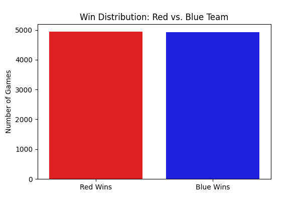
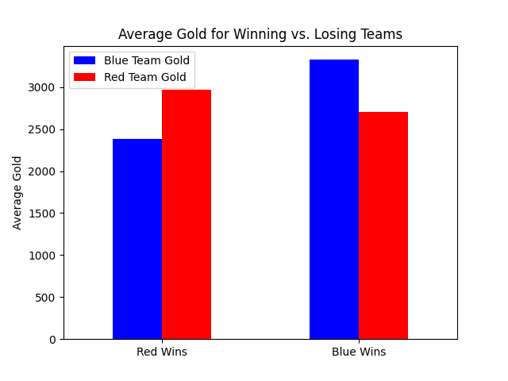
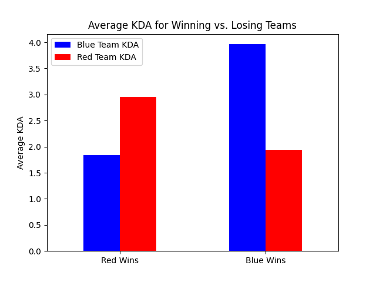
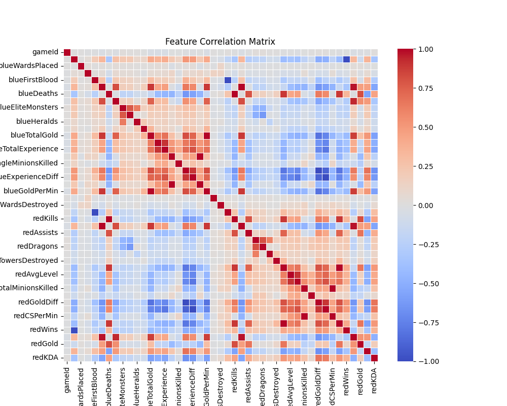

# Project of Data Visualization (COM-480)

| Student's name | SCIPER |
| -------------- | ------ |
| Jules chabod |345521 |
| Neil Chadli | 340813 |
| Mael Tournier | 345353 |

[Milestone 1](#milestone-1) • [Milestone 2](#milestone-2) • [Milestone 3](#milestone-3)

## Milestone 1 (21st March, 5pm)


### Dataset
League of Legends (LOL) is a fast-paced multiplayer online battle arena (MOBA) game by Riot Games. Players control unique champions/characters with special abilities, battling in teams to destroy the enemy Nexus (base). Strategy, teamwork, and skill are key to winning matches. With constant updates, esports tournaments, and a massive global community, it's one of the most popular games worldwide.
We will use the LOL Diamond Ranked Games (10 Min) dataset from Kaggle [Kaggle link](https://www.kaggle.com/datasets/bobbyscience/league-of-legends-diamond-ranked-games-10-min). This dataset contains match statistics from almost 10 0000 high-ranked games within the first 10 minutes, including player kills, vision control, jungle objectives, and gold differences.


### Problematic
Our project aims to analyze early-game factors that contribute to a team's victory in League of Legends, moving beyond basic win rate comparisons between the blue and red teams.


## Motivation & Audience
The targetted auiences are the following:
- **average players**: We find it interesting to dive deeper into game statistics and analyze the early-game meta, to help the average player understand the game better.  
- **Esports analysts & coaches**: Providing statistical and numerical proof  of the best early-game strategies that lead to success.  
- **Competitive players**: Gaining insights into effective playstyles.  
- **Game designers & analysts**: Evaluating balance in early-game mechanics.  

Rather than just predicting the winning team, our goal is to identify which gameplay decisions matter most in achieving victory. Also, as a beginner, gaining a better overall understanding of the strategies to adopt in the early game, a crucial phase at this level.


### Exploratory Data Analysis

You can find the details of the figures in the [EDA Notebook](EDA.ipynb)

## Win Distribution: Red vs. Blue Team
The dataset is balanced, with an almost equal number of wins for the blue team and red team. This indicates that the dataset does not have a bias toward one side.



## Average Gold for Winning vs. Losing Teams

The winning team consistently earns more gold than the losing team. This confirms that gold difference is a strong indicator of success.




## Average KDA for Winning vs. Losing Teams
The winning team consistently has a higher KDA, meaning kills and fewer deaths play a crucial role in determining victory.
When the blue team wins, their KDA is significantly higher than the red team's KDA, and vice versa.



## Feature Correlation Matrix


The correlation matrix shows that blueTotalGold and blueGoldDiff have a strong positive correlation with winning.
Other features like elite monsters taken (Herald, Dragons) and towers destroyed also show a strong impact.
Wards placed/destroyed have a weaker correlation, indicating that vision control might be a secondary factor compared to direct combat stats.

Next Steps:
	•	Perform PCA (Principal Component Analysis) to further analyze feature importance.
	•	Develop predictive models using the most impactful variables (gold, objectives, kills).
	•	Investigate whether early-game actions (first blood, early objectives) significantly affect the final outcome.

### Related work

This dataset, available on Kaggle, has already been explored by several users through notebooks like this one [here](https://www.kaggle.com/code/servietsky/league-of-legends-what-to-do-in-first-10-min) presenting basic statistics and correlations. However, we aim to stand out by offering a more visually engaging representation of the data.

Beyond a simple statistical analysis, we also want to develop a straightforward model (probably a logistic regression) that allows a player to input their game data after 10 minutes of play. This model would predict whether they were likely to win, providing valuable insights for potential improvement.

To present our data, we may take inspiration from previous years' projects, particularly the use of a slide-based scrolling system rather than continuous scrolling. This approach can provide a more immersive and structured experience, allowing users to focus on key insights step by step.

## Milestone 2 (18th April, 5pm)

Here is the [PDF of Milestone 2](Milestone/Milestone_2/milestone_2_project_atakhan.pdf), and [here is the current state of the website](https://com-480-data-visualization.github.io/com-480-project-Atakhan/).


## Milestone 3 (30th May, 5pm)

**80% of the final grade**
There is our [process book](process_book.pdf) and [the website](https://com-480-data-visualization.github.io/com-480-project-Atakhan/).
and here is the [vidéo presentation](https://www.youtube.com/watch?v=EihmxrgYejI)


## Late policy

- < 24h: 80% of the grade for the milestone
- < 48h: 70% of the grade for the milestone

## Running the Visualization Locally

To run this visualization on your local machine:

1. Clone the repository:
```bash
git clone https://github.com/com-480-data-visualization/com-480-project-Atakhan.git
cd com-480-project-Atakhan
```

2. Start a local server (choose one method):

Using Python:
```bash
# Python 3
python -m http.server 8000

# Python 2
python -m SimpleHTTPServer 8000
```

Using Node.js:
```bash
# Install http-server if you haven't already
npm install -g http-server
# Start the server
http-server
```

3. Open your browser and navigate to:
- If using Python: `http://localhost:8000`
- If using Node.js: `http://localhost:8080`

### Troubleshooting

If you see a blank visualization or get console errors:

1. Check your browser's console (F12) for error messages
2. Verify that all files are in their correct locations:
   - Main visualization file: `Beeswarm/beeswarm.js`
   - Data file: `Beeswarm/processed_data/shap_beeswarm_data.json`
3. Make sure you're running through a local server (not opening the HTML file directly)
4. Clear your browser cache if you've made recent changes

For any issues, please check the GitHub Issues page or create a new issue.

